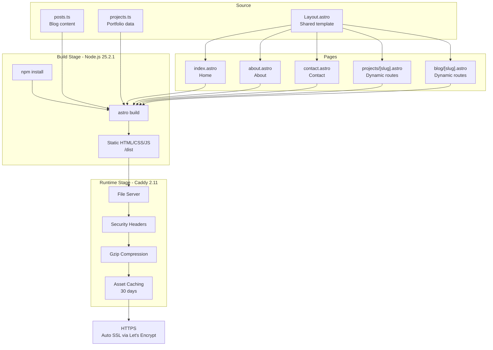

# Gabriel Palmar - Portfolio Website

Personal portfolio website showcasing projects, blog posts, and professional experience as a Solutions Engineer specializing in cloud infrastructure, DevOps, and networking.

**Live:** [gabrielpalmar.com](https://gabrielpalmar.com)

## Features

- **Portfolio** - Showcase of selected projects with detailed case studies.
- **Blog** - Technical articles and professional insights.
- **About** - Career timeline, skills, certifications, and experience.
- **Contact** - Professional contact information and availability.
- **Responsive Design** - Mobile-first approach with dark theme.
- **SEO Optimized** - Auto-generated sitemap and meta tags for easy Google index.

## Tech Stack

| Category | Technology |
|----------|------------|
| Framework | Astro 5 |
| Language | TypeScript |
| Markdown | Marked |
| Server | Caddy 2.11 (Alpine) |
| Container | Docker (multi-stage) |
| CI/CD | GitHub Actions |


Astro was used because it's lightweight and its easy implementation aligns with what a portfolio can provide, allowing for the use of templates and modification on the go if needed. Also, does not rely on JS, so its performance is not affected by its static nature. A bit of TypeScript was used to have global files under the [data](/src/data/) folder.

In addition to containerization for easy Compose launch, a GitHub Actions workflow helps push the image to the GitHub Container Registry.

## Architecture



## Project Structure

```
├── src/
│   ├── data/
│   │   ├── posts.ts          # Blog posts with metadata and content
│   │   └── projects.ts       # Portfolio projects with case studies
│   ├── layouts/
│   │   └── Layout.astro      # Base template (nav, footer, styles)
│   └── pages/
│       ├── index.astro       # Home page with hero and featured projects
│       ├── about.astro       # Timeline, skills, certifications
│       ├── contact.astro     # Contact methods and availability
│       ├── 404.astro         # Not found page
│       ├── projects/
│       │   ├── index.astro   # Projects gallery
│       │   └── [slug].astro  # Dynamic project detail pages
│       └── blog/
│           ├── index.astro   # Blog listing
│           └── [slug].astro  # Dynamic blog post pages
├── public/                   # Static assets (images, favicon, resume)
├── Dockerfile                # Multi-stage build configuration
├── docker-compose.yml        # Container orchestration
├── Caddyfile                 # Web server configuration
└── astro.config.mjs          # Astro configuration with sitemap
```

## Quick Start

### Development

```bash
npm install
npm run dev       # Starts dev server at localhost:4321
```

### Production Build

```bash
npm run build     # Generates static files in /dist
npm run preview   # Preview production build locally
```

### Docker

```bash
# Local development (builds from Dockerfile)
docker compose up --build

# Production (pulls from registry)
docker compose pull
docker compose up -d
```

## Environment Variables

| Variable | Default | Description |
|----------|---------|-------------|
| `DOMAIN` | `localhost` | Domain for Caddy SSL certificate |
| `IMAGE` | `ghcr.io/gabrielpalmar/website:latest` | Container image to use |

## Security

Caddy is configured with the following security headers:

- **HSTS** - Enforces HTTPS with preload
- **CSP** - Restricts content sources to prevent XSS
- **X-Frame-Options** - Prevents clickjacking
- **X-Content-Type-Options** - Prevents MIME sniffing
- **Referrer-Policy** - Controls referrer information
- **Permissions-Policy** - Disables unused browser APIs

## Deployment

The container exposes ports 80 and 443. Caddy intially handles automatic SSL certificate provisioning via Let's Encrypt. 

CloudFlare will manage the TLS settings in the future.

```bash
# Pull and run
docker pull ghcr.io/gabrielpalmar/website:latest

# With custom domain
DOMAIN=gabrielpalmar.com docker compose up -d
```

### Health Check

The `/health` endpoint returns `200 OK` for container health monitoring.
